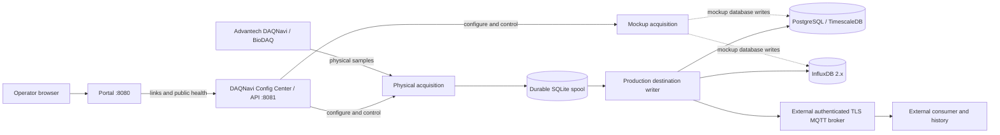

# IIoT data ingestion

This repository contains the DAQNavi acquisition service, its operator Config Center, a static service Portal, and separate MUSASHI II and MUSASHI IV services. The infrastructure, DAQNavi, and Portal run as separate Docker Compose projects.

## DAQ destinations

Production acquisition selects one destination at a time:

- **PostgreSQL/TimescaleDB** stores production samples and acquisition gaps in relational tables.
- **InfluxDB 2.x** stores production samples and gaps in measurements at nanosecond precision.
- **MQTT** publishes versioned JSON v1 sample and gap messages to an external broker. Authentication, TLS, QoS, and payload rules are defined in the [MQTT contract](docs/contracts/production-mqtt-contract-v1.md). The external consumer owns long-term history and downstream health.

DAQNavi commits production samples and gaps to its durable SQLite spool before delivery. The authoritative pending-record and destination-change rules are in the [production data flow](docs/architecture/data-flow.md) and [ADR 0014](docs/adr/0014-current-configuration-routes-pending-samples.md).

Mockup acquisition writes to database destinations. It does not publish MQTT messages. No local Mosquitto broker or MQTT-to-database subscriber is included.

## Deploy DAQNavi

Linux with Docker Engine and the Compose plugin is required. Physical acquisition also requires a supported Advantech DAQNavi/BioDAQ driver, SDK libraries, and device on the host.

Prepare private settings and start the services:

```bash
cp .env.example .env
cp deploy/daq-navi/.env.example deploy/daq-navi/.env
cp deploy/portal/.env.example deploy/portal/.env
mkdir -p deploy/daq-navi/config
cp services/daq_navi/config.json deploy/daq-navi/config/config.json
docker compose -f docker-compose.yml up -d
docker volume create iiot-data-ingest_daq_spool
docker compose --env-file deploy/daq-navi/.env -f deploy/daq-navi/compose.yml up -d --build
docker compose --env-file deploy/portal/.env -f deploy/portal/compose.yml up -d
curl http://localhost:8081/api/health
```

Review the private DAQ config for the installed device, enabled channels, calibration, destination, and startup mode before acquisition. Keep `.env` and `deploy/daq-navi/config/config.json` private. See [Linux deployment](DEPLOY_LINUX.md) for initial login, destination setup, operations, and migration details.

| Service | Default host port | Purpose |
| --- | ---: | --- |
| Portal | 8080 | Links to service interfaces and polls public health endpoints. |
| DAQNavi | 8081 | Operator login, Config Center, APIs, and acquisition control. |
| PostgreSQL/TimescaleDB | 5432 | Relational production destination. |
| InfluxDB | 8086 | Influx production destination. |

The MQTT broker is external and does not use a port from the root Compose project. MUSASHI services are deployed separately; Portal links do not start them.

## Runtime access and checks

Open `http://localhost:8081` and sign in to view status or change configuration. `/api/health` is public and returns minimal service health. Other DAQNavi APIs, including `/api/status`, require an operator session. The Config Center displays acquisition state, pending spool batches, recent gaps, and writer errors.

For authenticated workflows, use the Config Center. `/api/samples` returns recent database-backed samples for PostgreSQL/TimescaleDB or InfluxDB. When MQTT is selected, it returns local gap information and states that sample history belongs to the external consumer. `/api/retention` reads the TimescaleDB policy, reports Influx bucket-managed retention, or reports consumer-managed MQTT retention.

An API health response alone does not prove that samples are arriving at the destination. Confirm recent samples in the selected database or through the MQTT consumer. The DAQNavi Config Center has operator authentication; the Portal and MUSASHI interfaces do not provide built-in authentication. Use a trusted network or add access control before exposing those interfaces more broadly.

## Architecture



## Documentation map

- [Linux deployment and operations](DEPLOY_LINUX.md)
- [DAQ Config Center guide](services/daq_navi/web/README.md)
- [DAQ test and qualification guide](services/daq_navi/tests/README.md)
- [Domain language](CONTEXT.md)
- [Architecture diagrams](docs/architecture/)
- [Decision records](docs/adr/)
- [Production MQTT JSON v1 contract and fixtures](docs/contracts/production-mqtt-contract-v1.md)
- [Hardware notes](docs/hardware/PCI-1716.md)
- [Advantech software provenance](docs/third-party-provenance.md)
