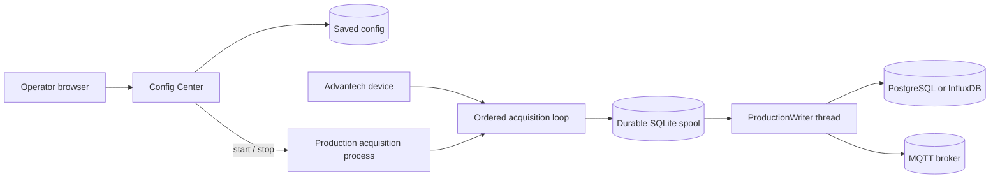

# Architecture and design boundaries

DAQNavi is an edge acquisition service operated through a Flask Config Center. The main Compose project starts DAQNavi with separate TimescaleDB, InfluxDB, and MQTT containers. It keeps the saved configuration in a writable host directory and each service's data in a named volume. Operators select one production destination at a time.

## Production threading model

The web service starts production acquisition in a child process so the operator UI and hardware lifecycle are separate. Within that process, one ordered acquisition loop reads the DAQ, timestamps and calibrates each batch, and commits it to SQLite. A dedicated `ProductionWriter` thread reads committed records from the spool and performs destination I/O. This producer/consumer split keeps database or broker network latency and retries out of the DAQ read loop: samples can continue to be collected while the destination is slow or unavailable, as long as the local spool can accept commits.

The local SQLite commit itself is synchronous in the acquisition process and must finish before the next loop iteration. The design therefore isolates collection from remote delivery, but does not promise hard real-time timing or immunity to slow local storage, CPU pressure, a full spool, or DAQ/driver read delays. If a batch cannot be committed because the spool is full, production acquisition stops and reports a fault rather than silently discarding it. A failure before commit can leave the in-flight hardware read unrecoverable; only committed batches are guaranteed to be available for replay.

The durable spool is the producer/consumer handoff and recovery boundary. Its lock serializes access to the shared SQLite connection and pending-record counters, while an exclusive file lock prevents two acquisition processes from owning the same spool at once. On shutdown, a stop event signals the writer to drain pending work for a bounded period. Records that are not acknowledged remain in SQLite for replay after restart. For MQTT, the Paho network loop runs in a background thread and signals publish completion to the writer according to the selected QoS.

## Why these boundaries exist

- **Local commit before delivery.** Hardware capture and destination availability have different failure modes. The writer can retry a committed batch after a destination outage or restart. A read that fails before its SQLite commit is outside that replay guarantee. See [production data flow](data-flow.md).
- **Separate destination containers.** The database and broker run on the Compose network and retain their data in distinct volumes. DAQNavi still addresses them through the destination interface, so an operator can select another reachable destination without changing acquisition code.
- **Writable config directory and separate spool volume.** Config Center replaces its JSON file atomically within the mounted directory. The spool remains available across container recreations. This is why deployment mounts the directory and retains a named volume.
- **Current config routes pending records.** Pending records use the latest destination after a change, while acknowledged history stays where it was written. This favors immediate recovery through the currently configured target and can split history across destinations. The decision and its duplicate risk are recorded in [ADR 0014](adr/0014-current-configuration-routes-pending-samples.md).
- **MQTT consumer owns history.** MQTT publication establishes a broker delivery boundary; it does not provide a local query store. Consumers own deduplication, retention, and historical queries. See the [MQTT v1 contract](production-mqtt-contract-v1.md).
