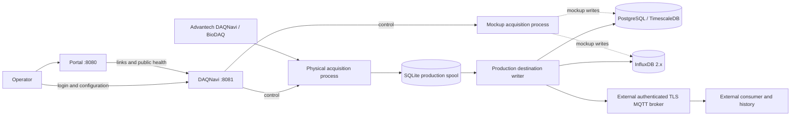

# System Context

DAQNavi acquires physical measurements or synthetic mockup measurements. Production samples and acquisition gaps are committed to a local spool before the production writer sends them to the single configured destination. PostgreSQL/TimescaleDB and InfluxDB provide queryable history; with MQTT, history and downstream health belong to the external consumer. Mockup acquisition writes only to database destinations. The repository does not include a local MQTT broker or an MQTT-to-database subscriber.

The [data flow](data-flow.md), [storage records](erd.md), and [acquisition sequence](sequences/streaming_pipeline.md) describe these boundaries in more detail.
