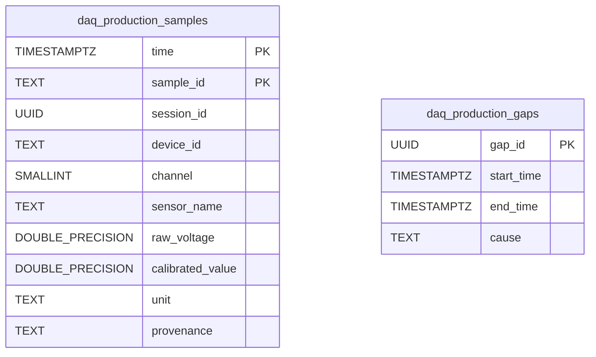

# Production Storage Records

The record shape depends on the selected production destination. The relational diagram below describes the PostgreSQL/TimescaleDB representation only; InfluxDB uses line protocol and MQTT uses the JSON v1 contract.

## PostgreSQL / TimescaleDB

`daq_production_samples` is a TimescaleDB hypertable partitioned by `time`. `sample_id` is the stable identity used to make retries idempotent. `daq_production_gaps` stores acquisition interruptions. The older `daq_telemetry` table created by `scripts/sql/db_setup.sql` is a separate legacy/mockup schema, not a view of the production hypertable.

## InfluxDB 2.x

Production points use nanosecond precision (`precision=ns`). The samples measurement is set by `INFLUX_MEASUREMENT` (default `daq_telemetry`):

- Tags: `device_id`, `channel`, `session_id`, `unit`, and `provenance`.
- Fields: `sample_id` (string), `raw_voltage` (float), and `calibrated_value` (float).
- Timestamp: the sample's Unix `time_ns`.

`sample_id` remains a field to avoid creating a high-cardinality series for every sample. Acquisition interruptions are written to the `daq_acquisition_gaps` measurement with stable `gap_id`, start/end times, cause, and open/closed state.

## MQTT

MQTT has no queryable DAQNavi history store. The writer publishes JSON v1 envelopes to separate per-device `samples` and `gaps` topics under `MQTT_PRODUCTION_TOPIC_PREFIX`. Sample envelopes include batch and chunk IDs plus individual production records. Gap events use a stable `gap_id` and increasing revision; a closed event contains its complete interval. Consumers own historical storage and merge duplicate or out-of-order events by their stable IDs and revisions. See the [MQTT v1 contract](../contracts/production-mqtt-contract-v1.md) and its [fixtures](../contracts/fixtures/).
