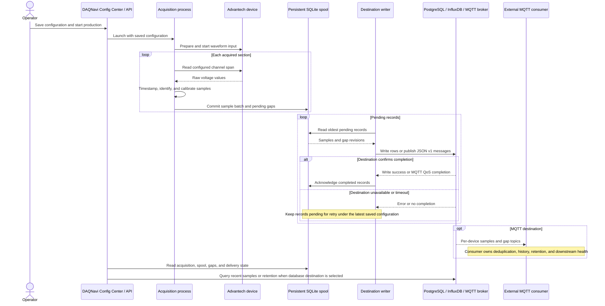

# Production Acquisition Sequence

MQTT QoS completion is defined in the [JSON v1 contract](../../contracts/production-mqtt-contract-v1.md). Pending-record routing and cutover behavior are defined in the [production data flow](../data-flow.md). `/api/samples` does not query local database history while MQTT is selected.
