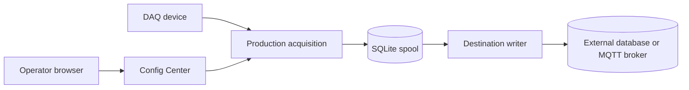

# DAQNavi

DAQNavi lets an operator configure an Advantech DAQ device, collect analog measurements, and deliver them to an existing PostgreSQL/TimescaleDB, InfluxDB 2.x, or MQTT destination. A persistent SQLite spool holds committed production records until delivery completes.

## Prerequisites

- Linux host with Docker Engine, the Docker Compose plugin, and OpenSSL for generating a session key. The image uses Python 3.12. See [host preparation and installation](DEPLOY.md#prepare-the-linux-host) for install instructions.
- A reachable destination managed outside this Compose project. The service can start before one is configured, but acquisition needs a working destination.
- For physical capture: a supported Advantech DAQ card and the DAQNavi/BioDAQ Linux driver and SDK installed on the host. The container receives the host device nodes and driver libraries through Compose; Docker does not install the vendor driver.

## Quickstart

Run from the repository root after cloning this repository. The example uses the bundled Compose file and starts only the DAQNavi service.

```bash
cp .env.example .env
sed -i "s/^DAQ_SESSION_KEY=.*/DAQ_SESSION_KEY=$(openssl rand -hex 32)/" .env
chmod 600 .env
docker compose up -d --build
curl http://localhost:8081/api/health
```

The health request should return JSON with `"service":"daq_navi"`. Open `http://<host>:8081` and sign in with the default username `admin` and default password `00000000`; change the password immediately. The first start creates the private `config/config.json` from the tracked template. Configure the physical device and a reachable external destination in Config Center before starting acquisition.

See [deployment and operations](DEPLOY.md) for the physical device checklist, updates, and backups. The [destination guide](docs/guides/configure-destination.md) explains how to point this standalone service at an existing destination.

## Environment variables

The tracked [.env.example](.env.example) is the source for the values below. Compose also sets `DAQ_CONFIG_PATH` and a persistent operator hash path inside the container.

| Variable | Purpose | Example value |
| --- | --- | --- |
| `DAQ_PORT` | Published host port for the web UI | `8081` |
| `DAQ_OPERATOR_USER` | Initial operator username | `admin` |
| `DAQ_OPERATOR_HASH` | Initial password hash; a hash saved in the spool takes precedence | starter hash |
| `DAQ_SESSION_KEY` | Signs operator sessions; replace before startup | generated secret |
| `ALLOWED_ORIGINS` | Browser origins accepted by the closed deployment | `*` |

Device, channel, and destination settings are saved in `config/config.json` by Config Center. The tracked [config.json](config.json) is a first-run template; its example database and InfluxDB addresses are not deployed by this Compose project. See [configuration reference](docs/reference/configuration.md).

## Testing and linting

The [test and qualification guide](tests/README.md) documents the standalone unit test command and separate physical qualification procedures. This checkout has no configured lint command.

## Architecture



The spool commits a batch before the writer tries delivery so an outage can leave records pending for replay. See [architecture and tradeoffs](docs/architecture.md), the [production data flow](docs/data-flow.md), and the [documentation index](docs/README.md).
